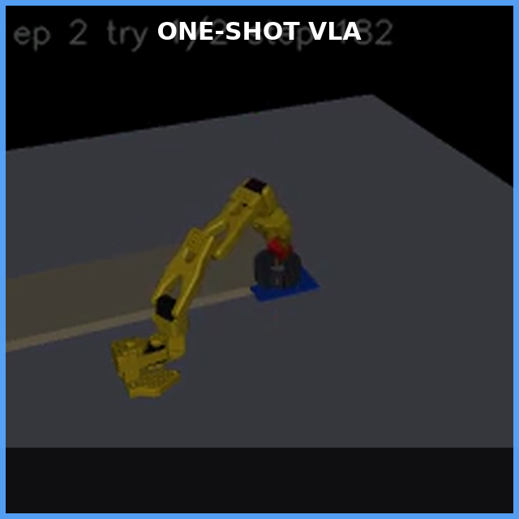
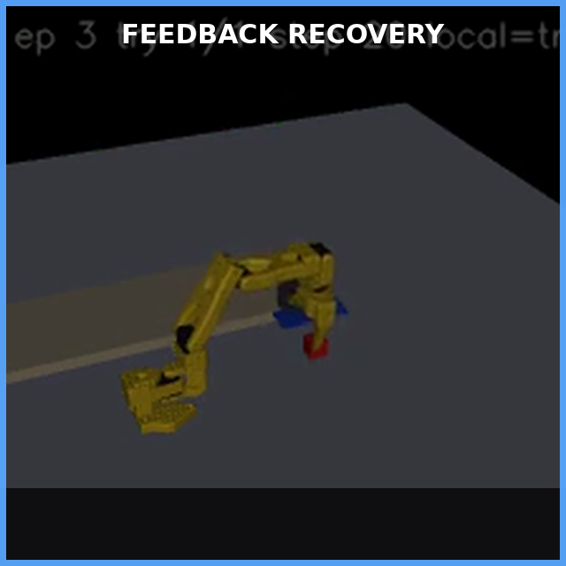
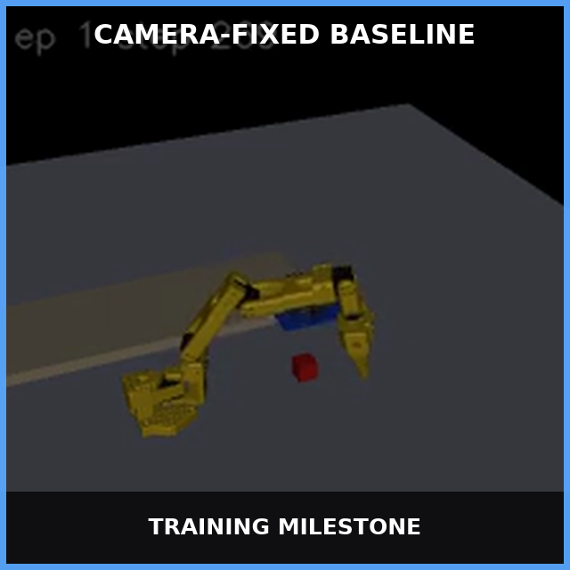
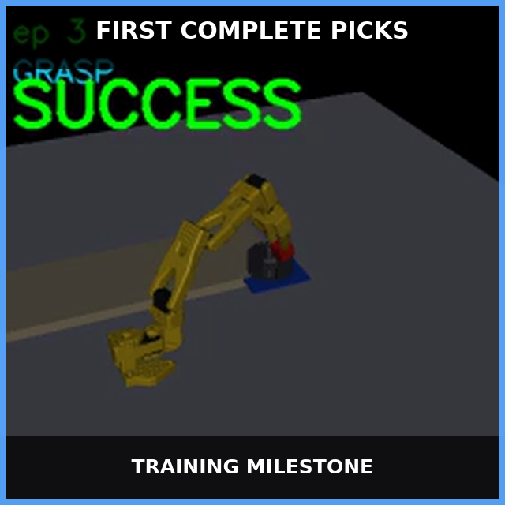
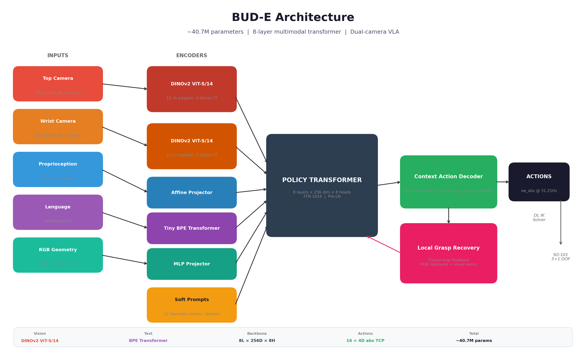

<div align="center">

# 🤖 BUD-E

### **A Compact Vision-Language-Action System for Closed-Loop Robotic Manipulation**

<p align="center">
  
  
  
  
  
</p>

<p align="center">
  <strong>🎯 94.5% success on 200 unseen random positions</strong> &nbsp;|&nbsp;
  <strong>🧠 ~40.7M parameters</strong> &nbsp;|&nbsp;
  <strong>🔁 Closed-loop grasp recovery</strong>
</p>

<p align="center">
  <a href="#video-gallery"><b>Video Gallery</b></a> ·
  <a href="#architecture"><b>Architecture</b></a> ·
  <a href="#quick-start"><b>Quick Start</b></a> ·
  <a href="docs/pick_vla_training_notes.md"><b>Technical Report</b></a>
</p>

</div>

---

<a id="video-gallery"></a>

## 🎬 See It In Action

Click either preview to open the full tracked MP4 directly on GitHub.

<table>
  <tr>
    <td align="center" width="50%">
      <a href="media/03_v43_one_shot.mp4">
        
      </a><br>
      <b>One-Shot VLA Policy</b><br>
      <sub>81.0% strict success · no recovery</sub><br>
      <a href="media/03_v43_one_shot.mp4"><b>▶ Watch MP4</b></a>
    </td>
    <td align="center" width="50%">
      <a href="media/04_v43_feedback_recovery.mp4">
        
      </a><br>
      <b>Feedback-Gated Recovery</b><br>
      <sub>94.5% strict success · in-place regrasp</sub><br>
      <a href="media/04_v43_feedback_recovery.mp4"><b>▶ Watch MP4</b></a>
    </td>
  </tr>
</table>

<details>
<summary><b>📹 Full Development Timeline</b></summary>

<table>
  <tr>
    <th width="25%">Stage</th>
    <th width="35%">Preview</th>
    <th width="40%">Milestone</th>
  </tr>
  <tr>
    <td><b>01 · Camera-Fixed Baseline</b></td>
    <td align="center"><a href="media/01_camera_fixed_baseline.mp4"></a><br><a href="media/01_camera_fixed_baseline.mp4">Watch MP4</a></td>
    <td>Corrected camera, timing, and observation contracts.</td>
  </tr>
  <tr>
    <td><b>02 · First Learned Picks</b></td>
    <td align="center"><a href="media/02_first_complete_pick.mp4"></a><br><a href="media/02_first_complete_pick.mp4">Watch MP4</a></td>
    <td>Spatially responsive shoulder control and complete transport.</td>
  </tr>
  <tr>
    <td><b>03 · Final One-Shot VLA</b></td>
    <td align="center"><a href="media/03_v43_one_shot.mp4"></a><br><a href="media/03_v43_one_shot.mp4">Watch MP4</a></td>
    <td>Fresh strict data, absolute TCP chunks, and corrected placement metrics.</td>
  </tr>
  <tr>
    <td><b>04 · Feedback Recovery</b></td>
    <td align="center"><a href="media/04_v43_feedback_recovery.mp4"></a><br><a href="media/04_v43_feedback_recovery.mp4">Watch MP4</a></td>
    <td>In-place reopen, visual realignment, verified regrasp, and continuation.</td>
  </tr>
</table>

</details>

---

## 📊 Results at a Glance

BUD-E exceeds its **80% acceptance target** on 200 unseen random cube positions using the strict placement definition (cube released inside the bowl, below the rim, moving slowly, and stable for 8 consecutive policy steps).

| Evaluation | Strict Success | Cube Contact | Strict Grasp |
|:-----------|:-------------:|:-----------:|:------------:|
| **VLA, one attempt** | **81.0%** (162/200) | 91.5% | 87.0% |
| **VLA + Local Recovery** | **94.5%** (189/200) | 99.5% | 98.0% |

> 🏆 **Local recovery converted 27 previous failures into successes with zero regressions.**

---

<a id="architecture"></a>

## 🏗️ Architecture

<div align="center">
  
</div>

### Core Design

BUD-E is built around five from-scratch components plus a pretrained vision backbone:

| Component | Details |
|-----------|---------|
| **👁️ Vision** | DINOv2 ViT-S/14 with 12-channel dual-camera/history adapter; last 4 blocks fine-tuned |
| **💬 Language** | Compact learned BPE text transformer (64 tokens max) + 32 task-domain soft prompts |
| **🦾 Proprioception** | 6-DOF affine feature projector (5 arm joints + gripper) |
| **🧠 Fusion Backbone** | 8-layer, 256-wide multimodal transformer with 8 attention heads, FFN 1024 |
| **🎯 Action Decoder** | Context transformer producing 16 absolute TCP/gripper targets |
| **📐 Spatial Residual** | Zero-initialized raw-geometry residual for precise spatial response |

**Input tokens:** `[soft_prompts(32) | state_token(1) | perception(1) | patch_tokens(196) | text_tokens(T)]`

**Output:** 16-step action chunk of `[tcp_x, tcp_y, tcp_z, gripper]` at 31.25 Hz

An orientation-constrained damped least-squares IK controller converts each TCP target into SO-101 joint commands.

---

## 🔁 Closed-Loop Local Grasp Recovery

BUD-E's key innovation is **feedback-gated local recovery** that wraps the VLA only after a failed grasp — successful trajectories pass through bit-for-bit unchanged.

```
Policy ──▶ Close Request ──▶ Wait 2 frames ──▶ Measure Jaw Position
                                    │
                    Blocked (≥0.08) │ Empty (<0.08)
                          ┌─────────┴─────────┐
                          ▼                   ▼
                   ✅ Grasp Verified     ❌ Begin Recovery
                                               │
                                               ▼
                                        Reopen at current TCP
                                               │
                                               ▼
                                        Back off 55 mm vertically
                                               │
                                               ▼
                                   RGB reacquires displaced cube
                                               │
                                               ▼
                              Visual servo: approach → descend → close → tighten
                                               │
                                               ▼
                                   Verify → Lift → Fresh VLA replan
```

**Critical properties:**
- ✅ No arm homing or cube reset
- ✅ No simulator state at inference (only cameras, joints, gripper feedback)
- ✅ Successful VLA rollouts are completely untouched
- ✅ Aborts after 2 failed local cycles instead of carrying empty

---

<a id="quick-start"></a>

## 🚀 Quick Start

### Installation

```bash
git clone https://github.com/LoopingOutLaw/BUD-E.git
cd BUD-E
python -m venv .venv
source .venv/bin/activate  # Windows: .venv\Scripts\activate
pip install --upgrade pip
pip install -e ".[sim,dev]"
```

**Requirements:** Python 3.11+, CUDA-capable PyTorch. Developed on RTX 4060 Laptop (8 GB VRAM).

For headless MuJoCo rendering:
```bash
export MUJOCO_GL=egl
export PYTHONPATH=src
```

### Reproduce the Full Pipeline

```bash
cd BUD-E
bash scripts/run_v43_strict_geometry.sh
```

This 10-stage pipeline performs expert validation → fresh data recording → replay validation → task-space conversion → frame cache → training → checkpoint selection → benchmarking → video export. It is resumable and has no wall-clock timeout.

### Run the Canonical Benchmark

```bash
MUJOCO_GL=egl PYTHONPATH=src python scripts/benchmark_random_pick.py \
  --ckpt checkpoints/pick_v43_strict_geometry/pick_v43_strict_geometry_best.pt \
  --raw-weights --num-episodes 200 --max-steps 650 --max-tries 1 \
  --local-grasp-retry --local-grasp-retries 2 --seed 4311 \
  --min-success-rate 0.80
```

### Run Tests

```bash
MUJOCO_GL=egl PYTHONPATH=src python -m unittest discover -s tests -v
```

---

## 📋 System Contract

The learned policy receives **only signals available on a physical arm**:

| Signal | Shape | Source |
|--------|-------|--------|
| Top RGB | 2 × 3 × 224 × 224 | Current + previous frame |
| Wrist RGB | 2 × 3 × 224 × 224 | Current + previous frame |
| Proprioception | 6 | 5 arm joints + gripper position |
| Instruction | ≤64 tokens | Compact BPE tokenizer |
| RGB Geometry | 3 | Normalized red centroid + visibility |

**Never provided:** MuJoCo cube coordinates, target-relative vectors, episode progress, simulator contacts, or success labels.

---

## 📁 Repository Layout

```
BUD-E/
├── media/                          # Curated milestone and final videos
│   └── bude_architecture.png       # Architecture diagram
├── docs/
│   └── pick_vla_training_notes.md  # Complete technical report
├── scripts/
│   ├── run_v43_strict_geometry.sh  # End-to-end reproduction pipeline
│   ├── train.py                    # Training + strict checkpoint selection
│   ├── benchmark_random_pick.py    # Broad random-position benchmark
│   ├── eval_pick_ball.py           # Video evaluation
│   ├── record_pick_episodes.py     # Fresh demonstration recorder
│   ├── validate_dataset_replay.py  # Persisted-action replay gate
│   └── build_frame_cache.py        # Bounded history-aware frame cache
├── src/bude_vla/
│   ├── models/                     # VLA model components
│   │   ├── policy.py               # Full BUD-E policy
│   │   ├── vision.py               # DINOv2 + ViT towers
│   │   ├── backbone.py             # 8-layer policy transformer
│   │   ├── action_head.py          # Flow-matching + BC heads
│   │   ├── soft_prompts.py         # Domain soft prompts
│   │   └── text_encoder.py         # BPE text transformer
│   ├── grasp_retry.py              # Feedback-gated local recovery
│   ├── visual_servo.py             # RGB localization + homography
│   ├── perception.py               # Red cube detection (camera-only)
│   ├── ik.py                       # Damped least-squares IK
│   └── envs/so101_mjx.py           # SO-101 MuJoCo environment
├── tests/                          # Regression tests
└── urdf/so101_official/            # Robot URDF and assets
```

---

## 🧪 Training Recipe (v43)

| Setting | Value |
|--------|------:|
| Image size | 224 |
| History frames | 2 |
| Chunk size | 16 |
| Batch size | 4 (×8 grad accum = 32 effective) |
| Planned steps | 220,000 |
| Main LR | 2e-5 |
| Action decoder LR | 1e-4 |
| DINOv2 LR | 1e-7 |
| BC objective | Masked L1 (weight 8.0) |
| Chunk-end weight | 4.0 |
| Gripper weight | 5.0 |
| Evaluation | 64 episodes on 8×8 grid every 10k steps |

**Key insight:** Checkpoint selection uses strict closed-loop success, not supervised loss. Later checkpoints can overfit even while training loss decreases.

---

## 🔬 Technical Report

The complete architecture specification, data pipeline, failure analysis, evaluation protocol, rejected approaches, and sim-to-real requirements are documented in:

📄 **[docs/pick_vla_training_notes.md](docs/pick_vla_training_notes.md)**

---

## 🛡️ Sim-to-Real Requirements

Before deploying on physical SO-101 hardware:

1. **Calibrate** joint directions, offsets, and hard limits
2. **Calibrate** top and wrist cameras; refit top-camera homography
3. **Calibrate** empty/blocked gripper feedback thresholds
4. **Limit** TCP velocity, joint velocity, gripper force, and recovery attempts
5. **Add** operator emergency stop and workspace exclusion zones
6. **Validate** perception and IK with the arm disabled
7. **Replay** slowly above the table before enabling contact
8. **Fine-tune** with real demonstrations for the visual/physics domain gap

---

## 📚 References

- [LeRobot SO-101](https://huggingface.co/docs/lerobot/main/en/so101)
- [LeRobot ACT](https://huggingface.co/docs/lerobot/act)
- [DINOv2](https://arxiv.org/abs/2304.07193)
- [OpenVLA](https://github.com/openvla/openvla)
- [OpenVLA-OFT](https://openvla-oft.github.io/)
- [ALOHA and ACT](https://tonyzhaozh.github.io/aloha/)
- [Diffusion Policy](https://diffusion-policy.cs.columbia.edu/)

---

## 📝 Citation

```bibtex
@software{bude_vla_2026,
  author = {Aditya Arora},
  title = {BUD-E: A Compact Vision-Language-Action System for Closed-Loop Pick-and-Place},
  year = {2026},
  url = {https://github.com/LoopingOutLaw/BUD-E}
}
```

---

<div align="center">

**Built with ❤️ by Aditya, 2026**

</div>
